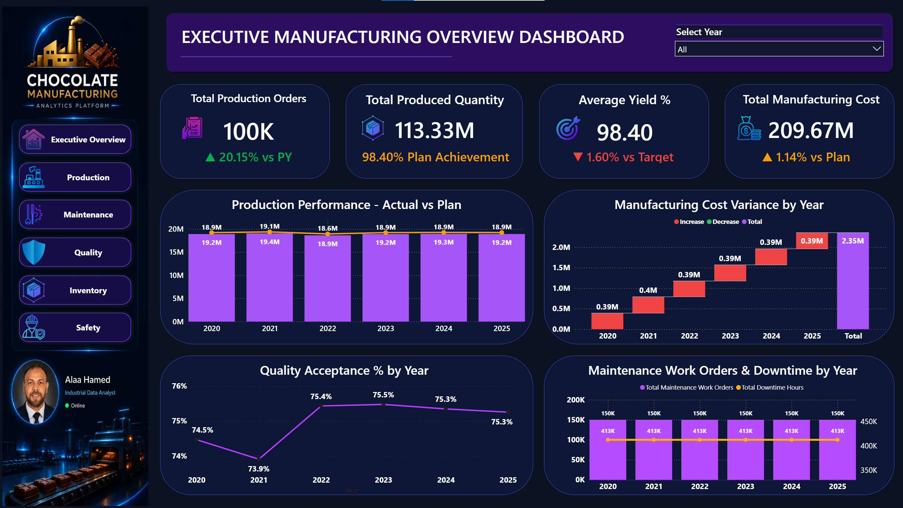
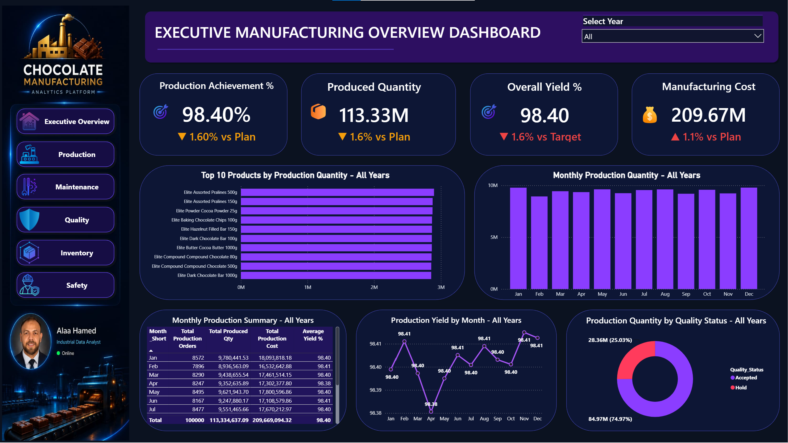

# 🍫 Chocolate Manufacturing Data Warehouse & Analytics

> **From Industrial Data to Actionable Manufacturing Insights**

A professional end-to-end **Industrial Data Analytics** project for a chocolate manufacturing environment.

This project demonstrates how raw manufacturing data can be transformed into a structured **Enterprise Data Warehouse**, validated through an ETL workflow, and converted into management-level insights through **Power BI dashboards**.

---

## 📌 Project Overview

The project was designed to simulate a real-world manufacturing data environment where multiple business departments generate operational data.

The solution integrates manufacturing data into a centralized **SQL Server Data Warehouse** using a **Star Schema** architecture.

The final analytical layer provides management and operational visibility through interactive **Power BI dashboards**.
---

## 🎯 Business Objectives

The main objectives of the project are:

- Centralize manufacturing data from multiple departments.
- Build a scalable Enterprise Data Warehouse.
- Improve data quality and reporting reliability.
- Support management decision-making.
- Monitor manufacturing KPIs.
- Analyze production performance.
- Analyze manufacturing costs.
- Monitor quality performance.
- Analyze maintenance work orders and downtime.
- Prepare structured data for Power BI analytics.
- Build a foundation for Predictive Maintenance and Machine Learning.

---

## 🏭 Business Departments

The Data Warehouse integrates data from multiple manufacturing functions:

- 🔧 Maintenance
- 🏭 Production
- 🛡️ Quality
- 📦 Warehouse / Inventory
- 💰 Finance
- 🦺 HSE — Health, Safety & Environment
---

# 🗄️ Data Warehouse Architecture

The solution follows a dimensional modeling approach using a **Star Schema**.

## Dimension Tables

- `Dim_Date`
- `Dim_Employee`
- `Dim_Equipment`
- `Dim_Product`

## Fact Tables

- `Fact_Work_Orders`
- `Fact_Production`
- `Fact_Inventory`
- `Fact_Quality`
- `Fact_NCR`

The architecture is designed to support analytical queries, KPI calculations and Power BI reporting.

---

# 🔄 ETL Workflow

The project follows a structured ETL workflow to transform raw manufacturing data into reliable analytical data.

1. Extract CSV files
2. Load into Staging Tables
3. Data Cleaning
4. Data Validation
5. Load Master Tables
6. Populate Data Warehouse
7. Create Relationships
8. Build Star Schema

### ETL Flow

```text
Raw CSV Data
     ↓
Staging Tables
     ↓
Data Cleaning
     ↓
Data Validation
     ↓
Master Tables
     ↓
Data Warehouse
     ↓
Star Schema
     ↓
Power BI
---

# 🛠️ Technologies Used

The project was developed using the following technologies and analytical concepts:

- **SQL Server 2022**
- **T-SQL**
- **Microsoft Excel**
- **Power BI**
- **Star Schema**
- **ETL**
- **Data Validation**
- **Data Warehousing**
- **Manufacturing Analytics**
- **Git & GitHub**

---

# 📊 Power BI Analytics

The project includes interactive Power BI dashboards designed to provide management and operational visibility across the manufacturing environment.

## 1️⃣ Executive Manufacturing Dashboard

The Executive Dashboard provides a management-level overview of manufacturing performance.

### Key KPIs

- Total Production Orders
- Total Produced Quantity
- Average Yield %
- Total Manufacturing Cost
- Production Plan Achievement
- Quality Acceptance %
- Maintenance Work Orders
- Maintenance Downtime

### Key Analytical Views

- Production Performance — Actual vs Plan
- Manufacturing Cost Variance by Year
- Quality Acceptance % by Year
- Maintenance Work Orders & Downtime by Year



---

## 2️⃣ Production Dashboard

The Production Dashboard provides deeper analysis of production performance and manufacturing output.

### Focus Areas

- Production Orders
- Produced Quantity
- Production Performance
- Production Trends
- Product-level Analysis
- Production KPIs
- Manufacturing Performance




---

# 💡 Executive Insights

The current analysis identified several important manufacturing insights.

## 🏭 Production Performance

Production achieved approximately **98.40% of the production plan**, indicating strong overall performance while maintaining a small gap versus planned output.

## ⚙️ Yield Performance

Overall yield reached approximately **98.40%**, remaining around **1.60% below target**.

This indicates an opportunity to reduce production losses and improve process efficiency.

## 💰 Manufacturing Cost

Total manufacturing cost reached approximately **209.67M**, around **1.14% above plan**.

Cost performance should therefore be monitored together with production performance.

## 🛡️ Quality Performance

Quality acceptance improved from approximately **73.9% in 2021** to around **75.5% in 2023**, followed by relative stabilization.

This indicates an improvement in quality performance with further optimization opportunities.

---

# 📈 Key Manufacturing KPIs

| KPI | Current Result |
|---|---:|
| Production Orders | 100K |
| Produced Quantity | 113.33M |
| Average Yield | 98.40% |
| Manufacturing Cost | 209.67M |
| Production Plan Achievement | 98.40% |
| Yield Gap vs Target | 1.60% |
| Manufacturing Cost vs Plan | +1.14% |

> KPI values are based on the current analytical dataset and dashboard model.

---

# 🖼️ Project Portfolio

A professional presentation was created to document the complete analytical journey of the project.

## Project Cover


## Full Project Presentation

[📑 View Project Presentation PDF](09_Portfolio/02_Presentation/Chocolate_Manufacturing_Data_Journey.pdf)

[📊 View PowerPoint Presentation](09_Portfolio/02_Presentation/Chocolate_Manufacturing_Data_Journey.pptx)

---

# 🗂️ Project Structure

```text
Chocolate_Manufacturing_DW
│
├── 01_Datasets
│
├── 02_SQL_Scripts
│
├── 03_Database_Diagram
│
├── 04_Documentation
│
├── 05_PowerBI
│   └── Chocolate_Manufacturing_Executive_Dashboard_Final.pbix
│
├── 06_Screenshots
│
├── 07_GitHub
│
├── 08_Machine_Learning
│
├── 09_Portfolio
│   │
│   ├── 01_Dashboards
│   │   ├── Executive_Dashboard.png
│   │   └── Production_Dashboard.png
│   │
│   ├── 02_Presentation
│   │   ├── Chocolate_Manufacturing_Data_Journey.pdf
│   │   └── Chocolate_Manufacturing_Data_Journey.pptx
│   │
│   └── 03_Project_Cover
│       └── Chocolate_Manufacturing_Data_Journey_Cover.png
│
└── README.md

---

# 📚 Database Documentation

The repository includes documentation covering the main components of the Data Warehouse:

- Project Overview
- Database Architecture
- Data Warehouse Design
- ETL Process
- Database Relationships
- Star Schema
- Data Validation

These documents provide technical details about the design and implementation of the solution.

